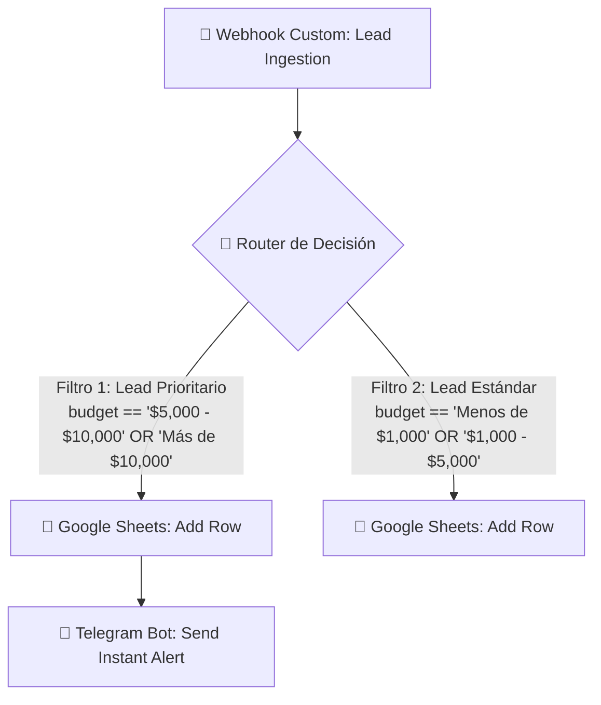

# ⚡ Automation & iPaaS Architecture (Make.com)

Esta carpeta documenta la arquitectura de integración serverless del escenario **CRM-Lead-Capture-Production** orquestado en Make.com (Integromat).

---

## 🏗️ Diagrama de Flujo del Escenario



---

## 📋 Módulos y Responsabilidades

### 1. Webhooks (Custom Webhook)
* **Endpoint:** HTTPS POST
* **Payload:** Recibe los datos JSON enviados por el formulario React (`fullName`, `email`, `phone`, `company`, `industry`, `budget`, `country`, `submittedAt`).
* **Contrato de Datos:** Ver [`webhook-contract.json`](./webhook-contract.json).

### 2. Router de Triaje (Lógica BANT)
* **Rama 1 (`Lead Prioritario`):**
  * **Condición:** Si `budget` contiene `$5,000 - $10,000` o `Más de $10,000`.
  * **Acción:** Inserta la fila en Google Sheets y despacha una alerta push inmediata a Telegram.
* **Rama 2 (`Lead Estándar`):**
  * **Condición:** Si `budget` contiene `Menos de $1,000` o `$1,000 - $5,000`.
  * **Acción:** Inserta la fila en Google Sheets para seguimiento asíncrono.

### 3. Google Sheets CRM (Persistencia)
* **Mapeo de Columnas:**
  | Columna | Variable del Webhook | Tipo de Dato |
  | :--- | :--- | :--- |
  | A (Nombre) | `1.fullName` | String |
  | B (Empresa) | `1.company` | String |
  | C (Sector) | `1.industry` | String |
  | D (Presupuesto) | `1.budget` | String |
  | E (Correo) | `1.email` | String |
  | F (Teléfono) | `1.phone` | String (E.164) |

### 4. Telegram Bot (Alertas Comerciales)
* **Plantilla del Mensaje:**
  ```text
  🚨 ¡NUEVO LEAD DE ALTO VALOR DETECTADO! 🚨

  👤 Nombre: {{1.fullName}}
  🏢 Empresa: {{1.company}}
  💼 Sector: {{1.industry}}
  💰 Presupuesto: {{1.budget}}
  📧 Correo: {{1.email}}
  📞 Teléfono: {{1.phone}}
  🕒 Fecha: {{formatDate(now; "YYYY-MM-DD HH:mm")}}

  👉 Contactar inmediatamente (SLA < 5 min).
  ```

---

## 💾 Cómo Exportar e Importar el Blueprint
1. En Make.com, abre tu escenario y haz clic en los 3 puntos (`...`) en la barra inferior.
2. Selecciona **"Export Blueprint"** para descargar el archivo JSON del escenario.
3. Guarda el archivo como `blueprint.json` en esta carpeta para versionar tus flujos como código.
