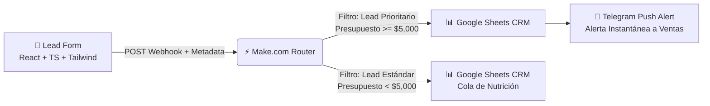

# 🚀 B2B Automated Lead Ingestion & Qualification Pipeline

[](https://github.com/vlessvndroo/crm-lead-capture-b2b/actions)
[](https://react.dev/)
[](https://www.typescriptlang.org/)
[](https://tailwindcss.com/)
[](https://vitejs.dev/)
[](https://www.make.com/)
[](https://core.telegram.org/bots/api)

> **Full-Stack B2B Growth Engine:** Sistema de captura, calificación y triaje en tiempo real de oportunidades comerciales B2B, diseñado para maximizar el *Speed-to-Lead* y priorizar cuentas de alto valor (*High-Ticket Accounts*) mediante flujos serverless.

---

## 📌 El Problema de Negocio (Business Context)

En ventas corporativas B2B, **el 78% de los clientes compra al primer proveedor que responde**. Retrasar el contacto más de 5 minutos reduce la probabilidad de conversión hasta en un **400%**. 

Este proyecto resuelve tres grandes fricciones operativas:
1. **Fuga de prospectos calificados:** Elimina tiempos muertos conectando prospectos de alto presupuesto con el cerrador de ventas en segundos.
2. **Triaje automático (Criterio BANT):** Clasifica leads según su presupuesto (*Budget*) antes de agendar llamadas, evitando reuniones improductivas.
3. **Cero trabajo manual:** Automatiza el registro en la base de datos (CRM) y notifica vía push sin que los comerciales tengan que monitorear plataformas manualmente.

---

## 🏗️ Arquitectura del Sistema



---

## ✨ Características Técnicas y UI/UX

* 🎨 **Phone Input Pixel-Perfect (Stripe/Airbnb Style):**
  * Selector de país con bandera, código de llamada dinámico (`+58`, `+1`, etc.) y dropdown nativo accesible en un bloque `bg-gray-50`.
  * Input numérico desacoplado y reactivo en bloque blanco (`flex-1`).
  * Alturas milimétricamente unificadas (`h-10` / `40px`) con estados `:focus-within` y transiciones fluidas.
* 🛡️ **Validación Reactiva Inline & Tipado Estricto:** Eliminación de alerts nativos, bordes dinámicos de error en rojo y helper text accesible.
* 🌐 **Desacoplamiento con Variables de Entorno:** Soporte para `VITE_MAKE_WEBHOOK_URL` configurable en producción/staging.
* ⚡ **Feedback Interactivo de Carga:** Botón con spinner SVG animado y banners de confirmación/error para una experiencia de usuario impecable.
* 🔄 **CI/CD Automatizado:** Pipeline con GitHub Actions que valida TypeScript y compila el bundle en cada commit.

---

## 🛠️ Stack Tecnológico

| Capa | Tecnología | Propósito |
| :--- | :--- | :--- |
| **Frontend** | React 19 + TypeScript | UI reactiva, modular y con tipado estricto |
| **Estilos** | Tailwind CSS 4 + Custom CSS | Diseño responsivo moderno y micro-interacciones |
| **Build Tool** | Vite 6 | Bundling ultrarrápido y HMR instantáneo |
| **Teléfonos** | `react-phone-number-input` | Validación y formateo telefónico internacional |
| **Middleware / iPaaS** | Make.com (Integromat) | Orquestación serverless, lógica de decisión y webhooks |
| **Almacenamiento** | Google Sheets API / CRM | Base de datos centralizada y auditable |
| **Notificaciones** | Telegram Bot API | Notificaciones push en tiempo real a comerciales |
| **CI/CD** | GitHub Actions | Automatización de pruebas de tipo y compilación |

---

## 🚀 Instalación y Ejecución Local

```bash
# 1. Instalar dependencias
npm install

# 2. Iniciar servidor de desarrollo
npm run dev
```

Abre [http://localhost:5173](http://localhost:5173) en tu navegador.
